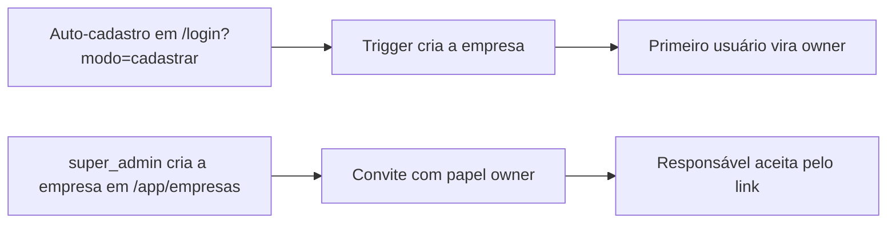

<p align="center">
  
</p>

<h1 align="center">Maintenex</h1>

<p align="center">
  Gestão de manutenção multiempresa: checklists preventivos, estoque de peças e pendências com SLA — no desktop e no celular.
</p>

<p align="center">
  <a href="https://www.maintenex.com.br">
    
  </a>
  
  
  
  
  
</p>

O **Maintenex** centraliza a rotina de manutenção de uma empresa: o técnico executa checklists no equipamento, registra movimentações de estoque e abre pendências; o gestor acompanha SLA, relatórios e cadastros; o responsável administra a equipe. Cada empresa enxerga apenas os próprios dados, garantido por Row Level Security no banco.

## ✨ Principais recursos

- checklists preventivos por equipamento, com seções e detalhes;
- estoque de peças com movimentações e saldo;
- pendências com SLA e acompanhamento;
- dashboard personalizável, relatórios e exportação CSV;
- multiempresa com cinco níveis de acesso e convites por link seguro;
- **experiência mobile**: shell responsivo, bottom navigation e atalhos personalizáveis por usuário;
- tema claro/escuro, busca rápida (`⌘K`) e notificações;
- landing pública com SEO (meta tags, Open Graph, JSON-LD, robots e sitemap);
- testes end-to-end com Playwright e testes de carga com k6;
- análise estática contínua com CodeQL.

## 🏗️ Arquitetura

```text
Navegador (React + Vite)
      ↓
Supabase (Auth + Postgres + RLS)
      ↓
Edge Function team-invites → Resend (e-mails de convite)
```

O frontend fala **diretamente** com o Supabase — não há servidor intermediário no caminho principal. As regras de autorização vivem no banco (policies e triggers), e a única lógica server-side é a Edge Function que emite convites de equipe.

| Diretório | Papel |
| --- | --- |
| `frontend/` | Aplicação React + Vite + TypeScript |
| `frontend/src/supabase/` | Migrations de schema, Edge Functions, scripts administrativos manuais, testes locais e seeds opcionais |
| `tests/e2e/` | Suíte Playwright (auth, checklist, estoque, pendências, convites, atalhos mobile…) |
| `tests/load/` | Cenários k6 (smoke, stress, carga de auth e app) |
| `backend/` | API Spring Boot legada, **mantida parada**. O produto não depende dela |
| `docker-compose.yml` | PostgreSQL local, usado apenas pelo backend legado |

> [!NOTE]
> `frontend/src/supabase` é o diretório canônico do Supabase CLI (`config.toml`, `migrations/`, `functions/`). Não use outras cópias que porventura existam no repositório.

### Rotas

| Rota | Acesso | Conteúdo |
| --- | --- | --- |
| `/` | público | landing page |
| `/login` | público | entrar, criar conta, recuperar senha |
| `/app` … `/app/configuracoes` | autenticado | painel: dashboard, checklist, equipamentos, estoque, pendências, relatórios, configurações |
| `/app/empresas` | `super_admin` | administração da plataforma |

## 🔐 Níveis de acesso

| Papel | Alcance |
| --- | --- |
| `super_admin` | Plataforma. Cria empresas e enxerga todas elas. Sem `empresa_id`. |
| `owner` | Responsável pela empresa. Convida usuários, define papéis, edita a empresa. |
| `gestor` | Cadastros (cidades, setores, equipamentos, materiais) + toda a operação. |
| `tecnico` | Operação: checklists, movimentações de estoque e pendências. |
| `leitor` | Somente leitura. |

Uma empresa entra de dois jeitos:



**Convites:** o responsável envia um link individual em **Configurações → Equipe**. A Edge Function `team-invites` gera o token, salva apenas o hash e, quando configurado, envia o e-mail via Resend. Em modo local/dry-run nenhum e-mail real é enviado. Ao criar ou acessar a conta pelo link, o token e o e-mail são validados antes do vínculo à empresa.

## 🛠️ Tecnologias

| Camada | Tecnologia |
| --- | --- |
| Interface | [React 19](https://react.dev/) + [React Router 7](https://reactrouter.com/) |
| Build | [Vite 8](https://vite.dev/) + [TypeScript 7](https://www.typescriptlang.org/) |
| Estilo | [Tailwind CSS 4](https://tailwindcss.com/), [shadcn/ui](https://ui.shadcn.com/), [lucide-react](https://lucide.dev/) |
| Animação | [GSAP](https://gsap.com/), [Motion](https://motion.dev/), [Lenis](https://lenis.darkroom.engineering/) |
| Gráficos | [Recharts](https://recharts.org/) |
| Backend as a Service | [Supabase](https://supabase.com/) — Auth, Postgres 17, RLS, Edge Functions |
| E-mail | [Resend](https://resend.com/) (via Edge Function e SMTP do Supabase Auth) |
| Testes | [Playwright](https://playwright.dev/) (e2e) e [k6](https://k6.io/) (carga) |
| Qualidade | CodeQL (GitHub Actions) |
| Hospedagem | [Vercel](https://vercel.com/) |

## 🚀 Como executar

### Pré-requisitos

- [Node.js](https://nodejs.org/) 20 ou superior e npm;
- um projeto no [Supabase](https://supabase.com/) (gratuito) com o schema aplicado — veja a seção **Configurar o Supabase** abaixo.

### 1. Clone o repositório

```bash
git clone https://github.com/yuuriic/maintenex.git
cd maintenex
```

### 2. Configure as variáveis de ambiente

```bash
cd frontend
cp .env.example .env   # preencha VITE_SUPABASE_URL e VITE_SUPABASE_ANON_KEY
```

### 3. Instale e rode

```bash
npm install
npm run dev
```

Abra [http://localhost:5173](http://localhost:5173) no navegador.

### Comandos disponíveis

Em `frontend/`:

| Comando | Descrição |
| --- | --- |
| `npm run dev` | Inicia o servidor de desenvolvimento |
| `npm run build` | Checa os tipos e gera a versão de produção em `dist/` |
| `npm run preview` | Serve a versão de produção gerada |
| `npm run typecheck` | Verifica os tipos sem gerar arquivos |
| `npm run ui:add` | Adiciona componentes shadcn/ui |

Na raiz do repositório:

| Comando | Descrição |
| --- | --- |
| `npm run test:e2e` | Executa a suíte Playwright |
| `npm run test:e2e:ui` | Abre o runner interativo do Playwright |
| `npm run test:e2e:headed` | Executa os testes com o navegador visível |

## ⚙️ Variáveis de ambiente

O frontend é Vite: **só variáveis com prefixo `VITE_` chegam ao navegador**. São lidas em tempo de build — ao alterá-las na Vercel, refaça o deploy.

| Variável | Obrigatória | Descrição |
| --- | --- | --- |
| `VITE_SUPABASE_URL` | sim | URL do projeto Supabase |
| `VITE_SUPABASE_ANON_KEY` | sim | chave `anon public` (ou `sb_publishable_…`) |
| `VITE_SITE_URL` | não | domínio público e destino dos links de recuperação |
| `VITE_API_URL` | não | URL da API Spring; sem ela, o frontend usa Supabase Auth diretamente |
| `VITE_EMAIL_OTP_LENGTH` | não | tamanho do OTP configurado no Supabase; padrão `8` |

> [!WARNING]
> Nunca publique a `service_role` no frontend e não crie variáveis `VITE_` para o Resend.

## 🗄️ Configurar o Supabase

### 1. Aplicar o schema

Com a CLI autenticada, a partir do diretório canônico:

```bash
cd frontend/src/supabase
supabase login
supabase link --project-ref SEU_PROJECT_REF
supabase db push --dry-run   # confira o que será aplicado
supabase db push
```

As migrations ficam em `frontend/src/supabase/migrations/` e são aplicadas em ordem:

| Faixa | O que faz |
| --- | --- |
| `0001` – `0012` | Tabelas, triggers, RLS, verificação de cadastro, hardening de autorização, checklists, grants e integridade multi-tenant |
| `20260910…` | Hardening de performance/RLS e personalização do dashboard |
| `20260911…` | Convites de equipe (`convites` + Edge Function `team-invites`) |
| `20260914…` | Correção de `row_security` nos helpers de RLS |
| `20260916…` | `profiles.atalhos_mobile` — atalhos da bottom navigation mobile por usuário |

Dados de demonstração opcionais ficam em `frontend/src/supabase/seeds/demo.sql` e devem ser executados manualmente somente quando necessário. Detalhes adicionais em [`frontend/src/supabase/README.md`](./frontend/src/supabase/README.md).

### 2. Criar o primeiro usuário

Acesse `/login?modo=cadastrar`, informe nome, **nome da empresa**, e-mail e senha. Esse usuário vira o `owner` da empresa criada.

### 3. Promover a administração da plataforma

Edite `frontend/src/supabase/admin-scripts/0003_promover_super_admin.sql` com o seu e-mail e execute no SQL Editor. Esse usuário passa a ver a aba **Empresas**.

### 4. Convites de equipe: Edge Function + Resend

O envio de convites roda em `team-invites`, uma Supabase Edge Function autenticada. O navegador chama a função com a sessão do usuário; a função valida `owner`/`super_admin`, normaliza o e-mail, trata usuário já existente e grava apenas o hash do token no banco.

Variáveis da função, sempre server-side:

| Variável | Uso |
| --- | --- |
| `SUPABASE_URL` | URL do projeto Supabase |
| `SUPABASE_ANON_KEY` | valida o JWT recebido do frontend |
| `SUPABASE_SERVICE_ROLE_KEY` | executa funções administrativas no banco |
| `RESEND_API_KEY` | chave do Resend, nunca exposta ao frontend |
| `INVITES_FROM` | remetente validado no Resend |
| `INVITES_DRY_RUN` | `true` impede envio real e retorna link seguro para teste |
| `SITE_URL` / `APP_SITE_URL` | origem pública usada no link `/login?modo=cadastrar&convite=...` |

`INVITES_DRY_RUN=true` ativa o modo teste e retorna o link seguro sem enviar e-mail real. Fora do dry-run explícito, ausência de `RESEND_API_KEY` ou `INVITES_FROM` é erro de configuração de envio.

### 5. E-mail transacional: Resend + Supabase Auth

1. No Resend, valide um domínio de envio e crie uma API key.
2. Em **Supabase → Authentication → Email → SMTP Settings**, habilite SMTP e use host `smtp.resend.com`, porta `465`, usuário `resend`, senha igual à API key e um remetente do domínio validado (por exemplo `no-reply@auth.seudominio.com`).
3. Mantenha **Confirm email** habilitado. No template **Confirm signup**, inclua `{{ .Token }}` no corpo; o cadastro aceita OTP de seis a oito dígitos.
4. Em **URL Configuration**, defina **Site URL** como o domínio de produção e adicione `https://SEU_DOMINIO/redefinir-senha` e `http://localhost:5173/redefinir-senha` nas Redirect URLs.

O mesmo SMTP envia confirmação e recuperação de senha. Para diagnosticar entrega, confira **Authentication → Logs** no Supabase e **Emails → Logs** no Resend; verifique também bounce, suppression e os registros SPF/DKIM/DMARC do domínio.

Se a API Spring for usada, configure no backend `SUPABASE_URL` e `SUPABASE_PUBLISHABLE_KEY`. Os endpoints públicos são `POST /api/auth/signup`, `/verify`, `/resend` (máximo de 3 reenvios por hora) e `/recover`.

## ☁️ Deploy na Vercel

| Configuração | Valor |
| --- | --- |
| Root Directory | `frontend` |
| Build Command | `npm run build` |
| Output Directory | `dist` |
| Variáveis | as `VITE_*` acima, nos três ambientes |

O `frontend/vercel.json` já traz o rewrite SPA para o React Router, redirects das rotas antigas para `/app/*`, cabeçalhos de segurança (CSP, HSTS, `X-Frame-Options`, `Permissions-Policy`) e cache imutável para `/assets`.

A `main` é protegida: toda mudança entra por pull request e precisa passar nos checks obrigatórios (CodeQL para `actions`, `java-kotlin` e `javascript-typescript`, além do deploy de preview da Vercel).

## 🛡️ Segurança

- RLS ativa em todas as tabelas; as políticas usam funções `security definer` (`empresa_atual()`, `eh_super_admin()`, `pode_gerir_cadastro()`, `pode_operar()`).
- Isolamento por `empresa_id`: um usuário só enxerga a própria empresa; `super_admin` vê tudo.
- Usuário desativado (`ativo = false`) perde leitura e escrita — os helpers retornam nulo/false.
- `anon` não tem acesso a nenhuma tabela (`revoke all … from anon`).
- Trigger `proteger_papel()` impede auto-escalação: ninguém altera o próprio papel ou a própria empresa, e só `super_admin` concede `super_admin`.
- Trigger `proteger_convite()` impede convite com papel `super_admin` e convite para outra empresa.
- A tabela `convites` é somente leitura para o frontend autenticado; criar, reenviar, aceitar e remover convites passa pela Edge Function `team-invites` com validações server-side e token individual.
- Atalhos mobile (`profiles.atalhos_mobile`) são preferência visual: o frontend cruza os ids salvos com as permissões do papel e descarta o que o usuário não pode acessar.

Vulnerabilidades: veja [`SECURITY.md`](./SECURITY.md).

## 🧪 Testes

```bash
# e2e (raiz do repositório) — sobe o Vite automaticamente
npm run test:e2e

# um arquivo específico
npx playwright test tests/e2e/atalhos-mobile.spec.ts

# relatório HTML da última execução
npx playwright show-report
```

Os testes de carga em `tests/load/` rodam com k6 e são disparados manualmente pelos workflows **Performance - Smoke Test** e **Performance - Stress Test** (GitHub Actions → *Run workflow*).

## 📂 Estrutura do projeto

```text
maintenex/
├── frontend/
│   ├── public/                 # Ícones, logo, Open Graph, robots e sitemap
│   ├── src/
│   │   ├── auth/               # AuthProvider e sessão Supabase
│   │   ├── components/         # Layout, BottomNav, navegação e UI compartilhada
│   │   ├── hooks/              # Hooks de dados e comportamento
│   │   ├── lib/                # Cliente Supabase, tipos e utilitários
│   │   ├── pages/              # Landing, Dashboard, Checklist, Estoque, Pendências…
│   │   └── supabase/
│   │       ├── migrations/     # Schema versionado (aplicado com `supabase db push`)
│   │       ├── functions/      # Edge Function team-invites
│   │       ├── admin-scripts/  # Scripts manuais (ex.: promover super_admin)
│   │       ├── seeds/          # Dados de demonstração opcionais
│   │       └── testes/         # Testes SQL locais
│   ├── .env.example
│   └── vercel.json
├── tests/
│   ├── e2e/                    # Suíte Playwright
│   └── load/                   # Cenários k6
├── backend/                    # API Spring Boot legada (parada)
├── .github/workflows/          # CodeQL, performance (k6) e publicação Maven
├── playwright.config.ts
└── docker-compose.yml
```

## ✅ Estado atual

- [x] Landing pública com SEO (meta tags, Open Graph, JSON-LD, robots, sitemap)
- [x] Autenticação Supabase (entrar, cadastrar, recuperar senha)
- [x] Dashboard, Checklist, Equipamentos, Estoque, Pendências, Relatórios, Configurações
- [x] Multiempresa com cinco níveis de acesso e convites por link seguro
- [x] Tema claro/escuro, busca rápida (`⌘K`), notificações, exportação CSV
- [x] Envio server-side de convite via Edge Function, com dry-run local e Resend restrito ao servidor
- [x] Shell responsivo, bottom navigation e atalhos mobile personalizáveis
- [x] Suíte e2e Playwright e testes de carga k6
- [x] `main` protegida com CodeQL e preview da Vercel como checks obrigatórios

---

<p align="center">
  Feito para simplificar a manutenção de quem cuida dos equipamentos todos os dias.
</p>
